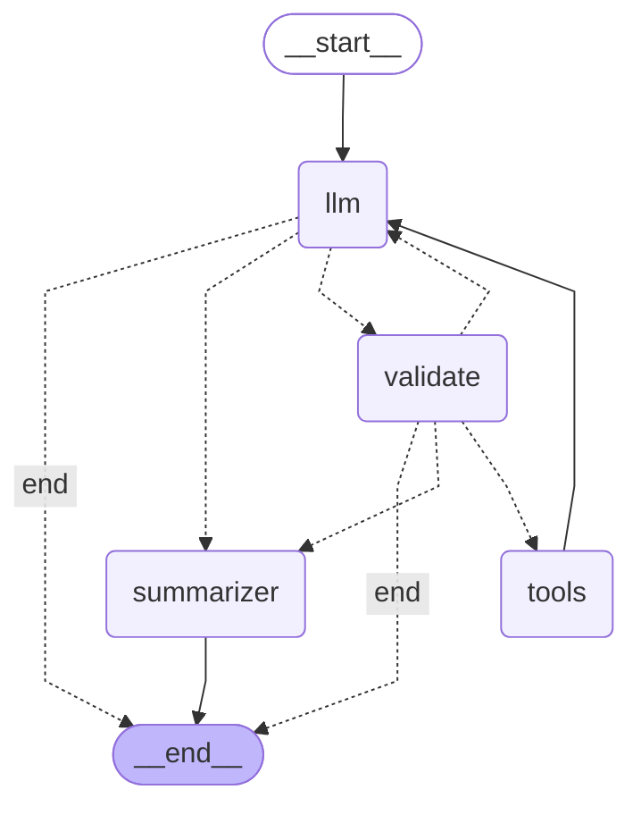

# Learn Agentic AI — From Scratch to Production

> A hands-on, module-by-module journey building production-grade AI agents.
> Each module pairs a focused tutorial with a working implementation, progressing
> from raw API calls to deployed multi-agent systems with full observability and governance.

[](https://www.python.org/downloads/)
[](https://opensource.org/licenses/MIT)
[]()

---

## Why This Repo

Most agent tutorials wrap LangChain around an OpenAI call and call it production.
This repo goes the other way: build the loop yourself first, then layer in frameworks,
memory, evaluation, governance, and deployment — each module solving a problem the
previous module exposed.

**Target audience:** data scientists and engineers who want to add agentic AI to their
toolkit with real depth, not buzzword-level familiarity.

All eight modules are complete: the curriculum runs end to end, from a raw
hand-written ReAct loop to a containerized agent deployed on Kubernetes and Cloud Run.

---

## Curriculum Roadmap

| Module | Focus | Status |
|--------|-------|--------|
| **1. Foundations** | ReAct loop, tool calling, multi-provider fallback | ✅ Complete |
| **2. LangGraph** | State machines, validation nodes, checkpointing | ✅ Complete |
| **3. Multi-Agent** | CrewAI, LangGraph multi-agent, role-based selection | ✅ Complete |
| **4. Memory & RAG** | Persistent state, vector retrieval, context engineering | ✅ Complete  |
| **5. Production Architecture** | Async, streaming, caching, orchestration patterns | ✅ Complete |
| **6. Observability & Eval** | Tracing, eval datasets, LLM-as-judge | ✅ Complete |
| **7. Governance & Guardrails** | Prompt injection, output validation, OWASP LLM Top 10 | ✅ Complete |
| **8. Deployment** | Agent → service → container → Kubernetes → Cloud Run | ✅ Complete |

---

## Tech Stack

- **[](https://www.python.org/downloads/)**
- **OpenAI SDK** (used as the OpenAI-compatible client for any provider)
- **Google Gemini API** — primary LLM provider (free tier)
- **Ollama qwen2.5:1.5b** — Local Small LM (free)
- **httpx** — async-ready HTTP client
- **python-dotenv** — environment variable management
- **FastAPI + Uvicorn** — the service shell (Modules 5, 7, 8)
- **Docker, Kubernetes, Cloud Run** — containerization and deployment (Module 8)

Get a free-tier Gemini API key at [aistudio.google.com](https://aistudio.google.com).
Download Ollama at: [ollama.com](https://ollama.com/download).
Anthropic is included in the provider chain at lower priority. To use Claude, set ANTHROPIC_API_KEY (root/.env) and either reorder ROLE_PREFERENCES to prefer it or run with Gemini disabled (root/lib/providers.py).

## Repo Structure

```
AgenticAI_for_Production/
├── .env.example              # Template for required environment variables
├── .gitignore
├── LICENSE
├── README.md                 # You are here
└── lib/                      # setting up automatic provider fallback policy and importability of the repo
    ├── __init__.py           
    └── providers.py
├── requirements.txt          # Pinned dependencies
├── README_PREREQUISITES.md   # System deps (LibreOffice, poppler) for the rendering path
└── module1_foundations/      # Foundations - building an agent from scratch in Python - without frameworks
    ├── agent_Claude.py
    ├── agent_Gemini_and_Ollama.py
    ├── tools.py
    └── README.md
└── module2_langgraph/        # Module 2: LangGraph framework
    ├── agent.py
    ├── state.py
    ├── tools.py
    ├── test_checkpoint.py
    ├── example.txt
    ├── graph.mmd
    └── README.md
└── module3_multiagent/           # Module 3: Multi-agent frameworks, using LangGraph (mainly) and CrewAI
    ├── 01_sequence_plus_critic_loop_CrewAI.py
    ├── 02_sequence_plus_critic_loop_langgraph.py
    ├── 03_hierarchical_langgraph.py
    ├── 03_hierarchical_graph.mmd    
    ├── 04_router_experts_langgraph.py
    ├── 04_router_experts_graph.mmd    
    ├── tools.py
    └── README.md
└── module4_memory_rag/
    ├── knowledge_base/              -- markdown corpus for RAG
    ├── 01_indexer.py                -- content-hash incremental indexer + retrieval
    ├── 02_memory_stores.py          -- semantic (SQLite) + episodic (ChromaDB) memory
    ├── 03_agent_langgraph.py        -- the three-layer memory agent
    ├── 04_test_episodic.py          -- 3-session test: write in session 1, recall in 3
    ├── 05_test_rag.py               -- RAG retrieval + factual refusal test
    ├── 06_inspect_memory.py         -- audit what the agent currently remembers
    └── README.md
└── module5_production/
    ├── 01_cache.py             -- two-layer cache + hit/miss counters
    ├── 02_retry.py             -- tenacity retry with exception classification
    ├── 03_telemetry.py         -- per-request structured logging
    ├── 04_agent.py             -- async RAG agent, token budget, cache integration
    ├── 05_service.py           -- FastAPI app with all endpoints + rate limiter
    ├── 06_load_test.py         -- concurrent load harness with cache clearing
    └── README.md
└── module6_observability_eval/
    ├── 01_eval_dataset.py       -- 20 unlabeled + 10 labeled cases
    ├── 02_metrics.py            -- four RAGAS metrics + deterministic citation check
    ├── 03_test_harness.py       -- runs agent over dataset, aggregates scores
    ├── 04_regression_test.py    -- baseline vs degraded-prompt comparison
    ├── 05_ragas_comparison.py   -- RAGAS side-by-side runner
    └── README.md
└── module7_governance_guardrails/
    ├── 01_input_guardrails.py     -- PII redaction + injection detection
    ├── 02_output_guardrails.py    -- PII leak + topic-scope + keyword fallback
    ├── 03_tool_guardrails.py      -- allowlist + approval flow + audit log
    ├── 04_hardened_service.py     -- service with all guardrails wired in
    ├── 05_red_team_dataset.py     -- 15 adversarial test cases
    ├── 06_red_team_runner.py      -- before/after attack scoring
    └── README.md
└── module8_deployment/
    ├── 01_agent.py                -- self-contained async agent (Module 5 patterns inlined)
    ├── 02_service.py              -- FastAPI: /health vs /ready, graceful shutdown
    ├── 03_Dockerfile              -- multi-stage build, non-root, slim runtime
    ├── 04_dockerignore.txt        -- rename to .dockerignore in the build context
    ├── 05_docker-compose.yml      -- app + Ollama as the resilience floor
    ├── 06_k8s/                    -- namespace, configmap, secret, deployment,
    │                                 service, HPA, ingress
    ├── 07_deploy_cloudrun.md       -- Cloud Run deploy guide + cost safety
    ├── LEARNING_LOG.md            -- honest deployment failure modes
    └── README.md

```
---

### Run it yourself

The steps are the same everywhere; only virtual-environment activation and the
system-dependency install differ by OS. Pick your platform below.

**1. Clone and enter the repo** (all platforms)

```bash
git clone https://github.com/ankitpani8/AgenticAI_for_Production.git
cd AgenticAI_for_Production
```

**2. Create and activate a Python 3.11 virtual environment**

<details open>
<summary><b>Windows (PowerShell)</b></summary>

```powershell
py -3.11 -m venv .venv
.venv\Scripts\Activate.ps1
```
</details>

<details>
<summary><b>macOS / Linux (bash/zsh)</b></summary>

```bash
python3.11 -m venv .venv
source .venv/bin/activate
```
</details>

**3. Install Python dependencies** (all platforms)

```bash
pip install --upgrade pip
pip install -r requirements.txt
```

**4. Install system prerequisites** (needed for the document-rendering path)

A couple of modules render `.docx` → PDF → images and need two tools that are
**not** pip-installable: **LibreOffice** (`soffice`) and **poppler-utils**
(`pdftoppm`).

<details>
<summary><b>Windows</b></summary>

- **LibreOffice:** download from [libreoffice.org/download](https://www.libreoffice.org/download/)
  and add `C:\Program Files\LibreOffice\program\` to your PATH.
- **poppler:** `choco install poppler` (Chocolatey), or download prebuilt binaries
  from [poppler-windows releases](https://github.com/oschwartz10612/poppler-windows/releases/)
  and add them to PATH.
</details>

<details>
<summary><b>macOS (Homebrew)</b></summary>

```bash
brew install libreoffice poppler
```
</details>

<details>
<summary><b>Linux (Ubuntu/Debian, incl. WSL)</b></summary>

```bash
sudo apt-get update && sudo apt-get install -y libreoffice poppler-utils
```
</details>

Verify: `soffice --version` and `pdftoppm -v` should both print a version.
See [`README_PREREQUISITES.md`](README_PREREQUISITES.md) for more detail.

**5. Add your API key** (all platforms)

```bash
cp .env.example .env
```

Open `.env` and set `GEMINI_API_KEY` (get a free-tier key at
[aistudio.google.com](https://aistudio.google.com)). Anthropic and OpenAI keys are
optional — the provider chain runs on Gemini plus local Ollama by default.

**6. (Optional) Install Ollama for the local-model fallback**

Several modules use a local `qwen2.5:1.5b` model as the bottom of the provider
chain (and for the `critic` role). Install from [ollama.com](https://ollama.com/download),
then pull the model:

```bash
ollama pull qwen2.5:1.5b
```

Skip this if you only want to run against Gemini — the chain falls back gracefully.

**7. Run a module**

Each module runs standalone from its own folder. For example:

```bash
python module1_foundations/agent_Gemini_and_Ollama.py
```

Run any file the same way, by pointing at its path in the repo structure above.
Each module's own `README.md` lists what to run and in what order.

---

## Architecture: Role-Based Model Selection

Every agent in this repo requests models by **role** (`heavy`, `light`, `critic`)
rather than by name. A startup health-check protocol pings each provider in the
role's preference chain and binds the first one that responds. This:

- Fails fast on quota/auth/network issues before agents run
- Decouples agent code from provider choice (policy is in `lib/providers.py`)
- Lets the critic role prefer a local Ollama model — demonstrating that critics
  shouldn't cost more than what they're critiquing (a key multi-agent pattern)

See [`lib/providers.py`](lib/providers.py) for the implementation.

---

## Module 1 — Foundations

**Goal:** Build a tool-calling agent from scratch, no frameworks, and learn what every
framework abstracts away.

### What's inside

- ReAct loop (Reason → Act → Observe) implemented in plain Python
- Three tools: `calculator`, `fetch_url`, `read_file`
- OpenAI-compatible client targeting Gemini, Ollama, and any other compatible provider
- Multi-provider fallback chain with exponential backoff
- Per-turn and per-run token accounting
- `MAX_TURNS` circuit breaker for runaway loops
- Tools that return errors as strings instead of raising exceptions

### Key concepts demonstrated

- The two-layer tool pattern (schema vs implementation)
- `stop_reason` as agent control flow
- Parallel vs sequential tool calls — and the non-determinism that makes them tricky
- Provider rate limits, quota errors, and graceful degradation
- Model self-imposed refusals (small models over-refuse repetitive requests)
- Why hosted APIs usually beat self-hosted models for low-end hardware

## Module 2 — LangGraph

**Goal:** Replace Module 1's hand-written ReAct loop with a state machine, and
use the new structure to add capabilities the loop couldn't easily support.

### What's inside

- Full LangGraph agent: typed state, three nodes (`llm`, `validate`, `tools`),
  conditional routing
- Validation node that rejects unsafe tool arguments and routes back to the LLM
- `MemorySaver` checkpointer for state persistence across invocations
- Multi-provider LLM fallback (Gemini Flash-Lite → Flash) encapsulated in one node
- Mermaid graph diagram exported directly from the compiled graph

### Key concepts demonstrated

- Control flow as graph topology, not embedded conditionals
- Reducers (`add_messages` append vs default replace)
- The `tool_call_id` ↔ `ToolMessage` contract
- Composability: how graph structure localizes future changes
- Defense in depth: LLM safety training + orchestration-layer guardrails
- Silent topology failures and why they motivate observability (Module 5)

### Why this matters
A `while` loop with `if/elif` works for one agent. Once you have multiple
specialized agents, parallel subagents, retry strategies that vary by error
type, or human-in-the-loop pauses — you need first-class control flow.
LangGraph (or something like it) is what every production agent system
converges on. Module 2 is where that transition happens in this repo.

See [`module2_langgraph/README.md`](module2_langgraph/README.md) for the
architecture diagram and detailed findings.

### What's new vs Module 1

- Agent expressed as a graph of nodes and edges, not a loop
- Typed state schema with reducers (append vs replace semantics)
- Validation node that inspects tool arguments and routes back to the LLM
  when they fail rules — pattern foundation for Module 6 guardrails
- Checkpointer (in-memory; SQLite-ready) for state persistence and resumption
- Mermaid diagram exported directly from the compiled graph


## Architecture: Role-Based Model Selection

Every agent in this repo requests models by **role** (`heavy`, `light`,
`critic`) rather than by name. A startup health-check protocol pings each
provider in the role's preference chain and binds the first one that
responds. This:

- Fails fast on quota/auth/network issues before agents run
- Decouples agent code from provider choice (policy is in `lib/providers.py`)
- Lets the critic role prefer a local Ollama model — demonstrating that
  critics shouldn't cost more than what they're critiquing

Supported providers: Gemini (primary), Ollama (local), Anthropic (optional
backup). See [`lib/providers.py`](lib/providers.py).

## Module 3 — Multi-Agent Systems

**Goal:** Implement four multi-agent topologies as separate scripts and
develop opinions on when each pattern earns its keep.

### What's inside
- Sequential pipeline with critic loop, in both CrewAI and LangGraph
- Hierarchical dispatch with parallel workers (`Send` API) and synthesis
- Router + specialist experts with scoped tools per specialist
- Side-by-side framework comparison (CrewAI vs LangGraph)
- Empirical measurement of the multi-agent token tax

### Key concepts demonstrated
- Topology and role policy as orthogonal design dimensions
- The `Send` API for dynamic parallel dispatch in LangGraph
- Capability scoping as a security pattern (not just a cost pattern)
- Hallucination by substitution as a failure mode of small manager models
- Why hierarchical loses on small N and only wins on large N

See [`module3_multiagent/README.md`](module3_multiagent/README.md) for
diagrams and findings.

## Module 4 — Memory and RAG

**Goal:** Build a personal assistant with three memory layers and a knowledge
base that incrementally reindexes itself, while encountering and naming the
failure modes of long-running memory systems.

### What's inside
- Content-hash incremental RAG indexing over a markdown corpus
- Three memory layers: conversation (LangGraph), semantic facts (SQLite),
  episodic summaries (ChromaDB)
- LLM-based fact extraction with deterministic validation downstream
- Factual-refusal guardrail when no context is available
- User-visible memory inspection for auditability

### Key concepts demonstrated
- Memory vs RAG (different lifecycle semantics, different storage)
- The smartness/dumbness split: LLM extracts, deterministic code validates
- Hallucination by substitution at every layer (extractor, summarizer)
- Memory rot and why memory inspection is essential UX
- The factual-refusal pattern as the cheapest hallucination guardrail

See [`module4_memory_rag/README.md`](module4_memory_rag/README.md) for
the architecture and findings.

## Module 5 — Production Architecture

**Goal:** Wrap Module 4's RAG agent in a production-style service shell —
the patterns that turn lab-grade code into something deployable.

### What's inside
- Async FastAPI service with full `async`/`await` stack
- Streaming endpoint via Server-Sent Events
- Two-layer cache (exact-match + semantic) with admin clear endpoint
- Tenacity retry policy with exception classification
- Per-request telemetry as JSON lines
- Per-IP rate limiting (slowapi)
- Token-budget cap with mid-run abort
- Concurrent load test harness with proper cache hygiene

### Key concepts demonstrated
- Async is necessary but not sufficient — backend must support concurrency
- The agent / service distinction (logic vs deployment shell)
- p50 vs p95 vs p99 — why production SLOs target the tail
- Cache contamination as a benchmarking pitfall
- Provider fallback as a defense against both runtime and config errors
- Rate limiting as both client-side reality and server-side responsibility

See [`module5_production/README.md`](module5_production/README.md) for
the architecture and findings.

## Module 6 — Observability and Evaluation

**Goal:** Make the agents from previous modules *measurable*. Add tracing
so we can see what they're doing; add an evaluation harness so we know how
well they're doing.

### What's inside
- LangSmith integration (zero-code, env-var-only) across the whole repo
- Eval dataset: 20 unlabeled + 10 labeled cases covering the Module 4 KB
- Four RAGAS-equivalent metrics implemented manually:
  faithfulness, answer relevance, context precision, context recall
- Fifth deterministic metric: source citation check
- Regression test: degrade a prompt, watch metrics drop
- RAGAS side-by-side comparison setup

### Key concepts demonstrated
- Trace as the right primitive for agent debugging (not logs)
- LLM-as-judge biases and their mitigations
- The eval feedback loop (production failure → regression test)
- Why deterministic metrics beat LLM-judges when properties are checkable
- Out-of-knowledge cases as first-class eval data
- The eval harness as the durable value; specific scores are domain-tunable

See [`module6_observability_eval/README.md`](module6_observability_eval/README.md)
for the metrics implementation and findings.

## Module 7 — Governance and Guardrails

**Goal:** Add the defensive layer — input/output/tool guardrails that turn a
working agent into one safe to put in front of adversarial users.

### What's inside
- Input guardrails: PII redaction (Presidio), injection detection, length checks
- Output guardrails: PII leak detection, topic-scope validation with
  deterministic fallback
- Tool guardrails: per-role allowlist, high-stakes approval flow, audit log
- Hardened FastAPI service wiring all three layers around the Module 5 agent
- 15-case adversarial red-team suite with false-positive checks

### Key concepts demonstrated
- Defense in depth: layered imperfect defenses, no single point of failure
- OWASP LLM Top 10 mitigations (injection, disclosure, excessive agency, etc.)
- LLM-as-judge guardrails inherit the judge's failure modes and availability
- The accuracy/safety tradeoff and why false positives matter
- Excessive-agency defense as architectural (allowlists) not promptable
- Supply-chain risk in production AI tooling

See [`module7_governance_guardrails/README.md`](module7_governance_guardrails/README.md)
for the architecture and findings.

## Module 8 — Deployment

**Goal:** Take one of the repo's own agents from `python agent.py` to a URL
other people can call — across a network boundary, inside a container, under an
orchestrator, on a cloud — and survive the ways each of those can break.

### What's inside
- A self-contained async agent — Module 5's patterns (telemetry, retry,
  exact-match cache) inlined, RAG replaced by an inline fact set — so the module
  runs with no cross-module imports or external state
- A FastAPI service exposing the liveness/readiness split: `/health`
  (is the process alive?) vs `/ready` (has a model provider been health-checked
  and bound?)
- A multi-stage Dockerfile: fat builder, slim non-root runtime, pinned base,
  layer-cached dependency install
- `docker-compose` wiring the app to a local Ollama as a **resilience floor** —
  the provider chain degrades to a local model when hosted providers fail
- A complete Kubernetes bundle: namespace, configmap, secret template,
  deployment with startup/liveness/readiness probes and resource limits, service,
  HPA, ingress
- A Cloud Run deploy guide with the scale-to-zero cost model and safety rails

### Key concepts demonstrated
- Liveness vs readiness, and why pointing both at one endpoint causes restart loops
- Readiness as the deployment face of the startup health-check protocol from
  `lib/providers.py` — "ready" means a model in the role's chain answered and bound
- Multi-stage builds, non-root containers, and keeping secrets out of image layers
- The resilience floor is environment-dependent — local Ollama where you control
  the host, a cheap hosted model where you don't (Cloud Run)
- Scale-to-zero economics: pay per request, cap max-instances, keep min-instances
  at zero
- Why serverless often wins for bursty agent traffic

The honest failure modes — restart loops from probe misconfiguration, the startup
health-check fighting cold starts, `min-instances > 0` as a silent bill,
autoscaling that scales for attackers too — are in
[`module8_deployment/LEARNING_LOG.md`](module8_deployment/LEARNING_LOG.md).

This module closes the arc: across eight modules the repo goes from a
hand-written ReAct loop to a deployed, observable, guarded, self-healing agent.

See [`module8_deployment/README.md`](module8_deployment/README.md) for the full
walkthrough.

---

## From patterns to product

These eight modules are the foundation for a real application built on the same
principles — **[Chakiri](https://github.com/ankitpani8/chakiri-web)**, an agentic
résumé-tailoring and job-search system (*chakiri* is the Odia word for "job"). It
puts the repo's lessons to work: role-based model routing, deterministic guarantees
around LLM judgment, honest-gaps-over-fabrication, and the deploy patterns from
Module 8. The public landing page and progress live at
[github.com/ankitpani8/chakiri-web](https://github.com/ankitpani8/chakiri-web).

## Notes for Visitors

This repo is complete — all eight modules are built, tested, and documented.
Each module is tagged on GitHub (e.g., `v0.1.0-module1`) — browse the
[Releases](../../releases) page to see milestone-by-milestone progress with
summaries.

I'm documenting findings publicly because most production lessons in agentic AI
aren't in the docs — they're in the failure modes. This repo captures both.

---

## Connect

- LinkedIn: [@ankitpani](https://www.linkedin.com/in/ankitpani/)
- GitHub: [@ankitpani8](https://github.com/ankitpani8)

---

## License

MIT — see [LICENSE](LICENSE).
